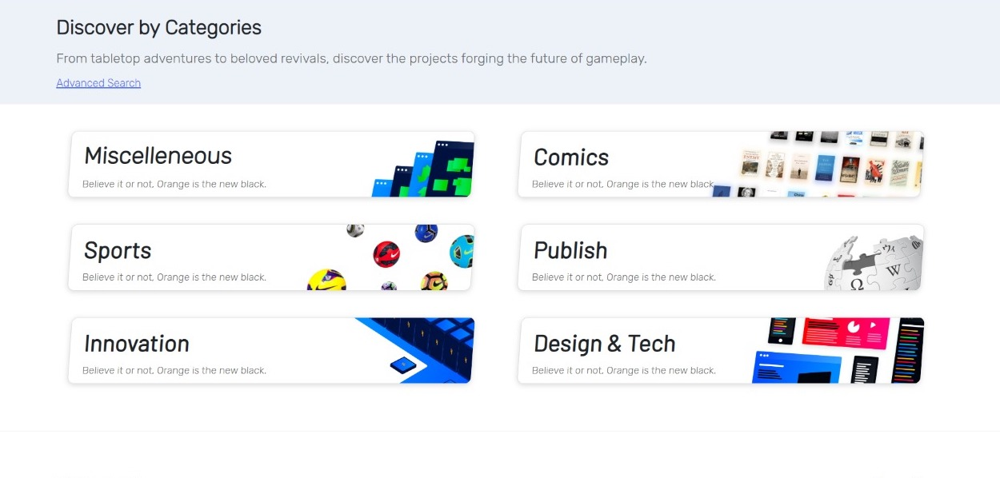

# Crowdfunding Platform
###### Reward based Crowdfunding platform for creators and backers using Angular Framework, Express.js on top of node.js and MySql.  
 

##  Application Usage
### Run Angular server
1. Navigate to `/crowd-funding-angular`.
2. Open terminal in current directory.
3. Run `npm install` to install all the dependencies.
4. To start the server, run `ng serve` in the terminal.
5. Server will start on http://localhost:4200/.

### Run node.js server
1. Navigate to `/api-node`.
2. Open terminal in current directory.
3. Run `npm install` to install all the dependencies.
4. To start the server, run `nodemon` in the terminal.
5. The backend server will start on http://localhost:3000/.

