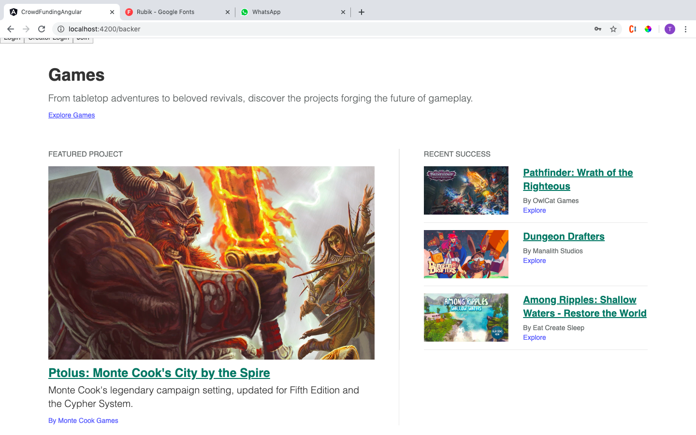
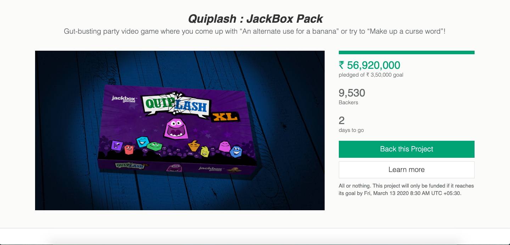

# Application Preview

## Instructions
- api node folder contains backend use npm i to install packages and node app.js to start 
- crowd-funding-angular conatins frontend use npm i to install packages and npm start to start
- crowd_funding.sql constains database 

